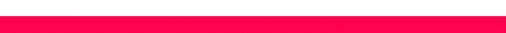

# 

  

## 🙋‍♂️ About Me

Hey there! I'm a passionate 19-year-old freelance graphic designer, 3D modeler, and coding enthusiast. I discovered my love for design and programming at a young age and have been honing my skills ever since.

As a full stack developer, I enjoy working on both the front-end and back-end aspects of web development, my preference is with front-end development though. I find great satisfaction in creating visually appealing and user-friendly interfaces while ensuring the underlying functionality is robust and efficient.

When I'm not coding or designing, you can often find me exploring my other passions. I have a love for music and enjoy singing in my free time. Additionally, I have interests in woodworking and 3D printing, which allow me to enjoy crafting unique pieces and useful tools that combine functionality and aesthetic appeal!

If you have any exciting projects or ideas, I'd love to collaborate and bring them to life. Feel free to reach out to me through the contact information provided below. I look forward to hearing from you!

## 🎨 Graphic Design Skills

- Adobe Photoshop 
- Adobe Illustrator 
- Adobe After Effects 
- Adobe Premiere Pro 
- Blender (for 2D/3D graphic design + animation) 

## 💻 Programming Skills

- Python 
- HTML 
- JavaScript 
- Node.js 
- SQL 
- PHP 
- Lua 
- C# (some experience) 

## 📬 Contact Me

- Discord: MMeta
- Business Email: Metavr@yahoo.com
- ~~Website: [meternalized.online](https://www.meternalized.online) (links to my socials)~~ (Currently down because I didn't pay my hoster 😍)

## 🚀 Projects

As a freelancer, I've had the opportunity to work on a wide range of projects that allowed me to combine my love for graphic design and programming. Whether it's creating visually appealing designs or building responsive web applications, I find joy in turning my ideas into reality.

If you have any questions, want to collaborate on a project, or simply want to ask me some questions, don't hesitate to reach out! I'm always happy to meet new people and discuss ideas.

## 📊 GitHub Stats

  
  

---

  
   
  

    Let's create something cool together! 🙌
  

🎵 Currently Vibing To

  

